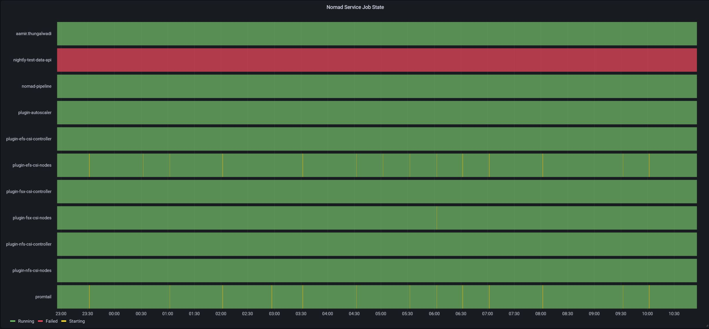

# nomad-monitoring
Monitoring Nomad job states using Grafana state timeline visualization

## Pre-requisites

* Grafana - for dashboard and visualization
* Prometheus - to scrape metrics from nomad servers

## Promethues scrape config

* Setup promethues to scrape metrics from target nomad servers. 
* Define a `metric_relabel_configs` section to replace individual `nomad_nomad_job_summary_*` state metric as a state label in a generic `nomad_nomad_job_summary` metric.

```
metric_relabel_configs:
  - source_labels: [__name__]
    regex: nomad_nomad_job_summary_(unknown|queued|starting|running|failed|complete|lost)
    replacement: "$1"
    target_label: state
  - source_labels: [__name__]
    regex: nomad_nomad_job_summary_(unknown|queued|starting|running|failed|complete|lost)
    replacement: nomad_nomad_job_summary
    target_label: __name__
```

Refer [prometheus-scrape-config.yaml](examples/prometheus-scrape-config.yaml) example file.

## Grafana Visualization

* Use the modified `nomad_nomad_job_summary` metric as a table format
* Setup `Grouping to matrix` transformation to use `exported_job` as column with `Time` as row and `state` as cell value
* Transform `Time\exported_job` as `Time` format using `Convert field type` transformation
* Configure Value mappings to define a Display Text and a color code for different state value

Refer [grafana_dashboard.json](examples/grafana_dashboard.json) example JSON file to setup grafana dashboard and visualization.

The final grafana visualization will look similar to below image:


